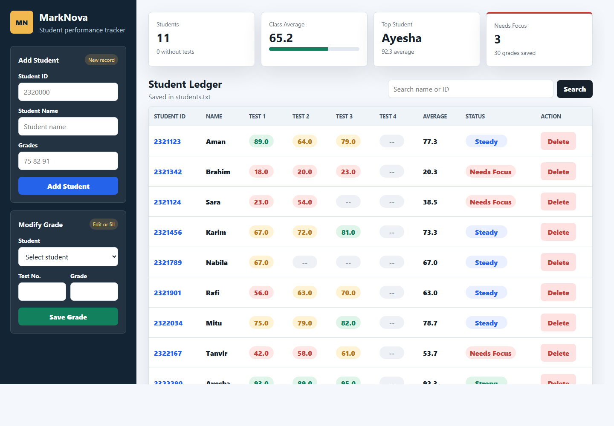

# MarkNova Student Grade Manager

A Python and Flask application for managing student records and quiz/test grades.

## Overview

This project loads student data from a text file, allows the user to view and update records through either a console menu or the MarkNova browser interface, and saves the updated data back to the file.

## Preview



## Features

- Display grade information for all students
- Display grade information for one student
- Show average grades for all students
- Modify a specific quiz/test grade
- Add a new test grade for all students
- Add a new student
- Delete a student
- Save updated data to file

## Project Files

- `main.py` - main Python program
- `students.txt` - student data file
- `CSE_101_Project_Spring_2026.pdf` - project specification

## Requirements

- Python 3
- Flask

## How to Run

### Console version

1. Open a terminal in the project folder.
2. Run:

```bash
python main.py
```

3. Use the menu options shown in the terminal.

### Browser GUI version

1. Install Flask if needed:

```bash
pip install -r requirements.txt
```

2. Start the Flask app:

```bash
python app.py
```

3. Open this address in your browser:

```text
http://127.0.0.1:5000
```

## Sample I/O

Example console session:

```text
--------------- MENU ----------------
1. Display Grade Info for all students
2. Display Grade Info for a particular student
3. Display tests average for all students
4. Modify a particular test grade for a particular student
5. Add test grades for a particular test for all students
6. Add a new Student
7. Delete a student
8. Save and Exit
Please select your choice: 1

StudentID   Student Name          Test1   Test2   Test3
2321123     Aman                  21.0    24.0
2321342     Brahim                18.0    20.0    23.0

Press Enter key to continue . . .

--------------- MENU ----------------
1. Display Grade Info for all students
2. Display Grade Info for a particular student
3. Display tests average for all students
4. Modify a particular test grade for a particular student
5. Add test grades for a particular test for all students
6. Add a new Student
7. Delete a student
8. Save and Exit
Please select your choice: 2
Enter studentID: 2321342

StudentID   Student Name          Test1   Test2   Test3
2321342     Brahim                18.0    20.0    23.0

Press Enter key to continue . . .

--------------- MENU ----------------
1. Display Grade Info for all students
2. Display Grade Info for a particular student
3. Display tests average for all students
4. Modify a particular test grade for a particular student
5. Add test grades for a particular test for all students
6. Add a new Student
7. Delete a student
8. Save and Exit
Please select your choice: 8
Data saved. Exiting program.
```

## Data File Format

Each line in `students.txt` follows this format:

```text
StudentID# Student Name# grade1 grade2 grade3
```

Example:

```text
2321123# Aman# 21.0 24.0
2321342# Brahim# 18.0 20.0 23.0
```

## Notes

- Grades are stored as numeric values.
- The program reads all student data at startup.
- Changes are written to `students.txt` only when you choose `Save and Exit`.

## Author

Student grade management project.
